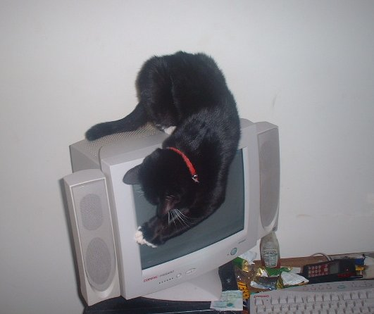
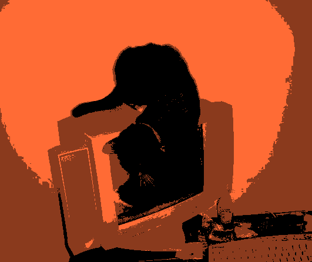

made a little image processor for images i was doing in gimp, these images are for graphics in the terminal website but idk

you only need pillow to run it

pip install pillow

SHOWCASE

before:

after:

